# Messy Mashup: Genre Classification from Audio

## Messy Mashup Audio Genre Classification
**Live Web Demo:** [Try the deployed model on Hugging Face Spaces](https://huggingface.co/spaces/imranjan/audio-genre-classifier)

A deep learning project designed to solve the *Messy Mashup: Genre Classification from Audio* Kaggle competition. The objective is to accurately predict the musical genre of 30-second noisy audio mashups synthesized from diverse and overlapping stem tracks augmented with background noise.

To solve this, a progressive experimentation approach was taken, starting from a traditional Machine Learning baseline and advancing to state-of-the-art Deep Learning and Transformer-based models. 

The final solution is a **Weighted Ensemble** of CNN, CRNN, and a fine-tuned **HuBERT** transformer, utilizing **Systematic Test Time Augmentation (TTA)** to achieve robust predictions on noisy audio.

---

## Milestone Tracker

The project was developed in incremental milestones. The code for each milestone is stored in the `/notebooks` folder.

| Milestone | Branch/Status | Description | Key Tech Stack |
|-----------|---------------|-------------|----------------|
| **M1** | Completed | Exploratory Data Analysis (EDA), WandB tracking setup, and a Random Guess baseline. | `pandas`, `torchaudio`, `wandb` |
| **M2** | Completed | Traditional ML Baseline. Extracted 40+ handcrafted audio features (MFCC, Chroma, Spectral Contrast) and trained an XGBoost classifier. | `librosa`, `xgboost` |
| **M3** | Completed | Deep Learning Baseline. Built a CNN from scratch on 2D Mel Spectrograms. Introduced **Cross-Song Stem Mixing** and ESC-50 noise injection data augmentation. | `torch`, `torchaudio` |
| **M4** | Completed | Recurrent Neural Networks. Added a Bidirectional LSTM (BiLSTM) on top of the CNN (creating a CRNN) to capture temporal musical patterns. | `torch`, `torchaudio` |
| **M5** | Completed | Transformer Fine-Tuning. Fine-tuned **HuBERT** (Hidden-Unit BERT) using a **Phased Training** strategy. Applied Systematic TTA and Weighted Soft Voting Ensemble for final submission. | `transformers`, `torch` |

---

## Key Techniques & Innovations

<div align="center">
  
</div>

1. **Cross-Song Stem Mixing:** Instead of training on clean songs, the custom PyTorch `Dataset` mixes stems (vocals, drums, bass, other) from *different* songs of the same genre on the fly, perfectly mirroring the noisy test distribution.
2. **Dynamic Noise Injection (ESC-50):** Applied realistic environmental noise at random Signal-to-Noise Ratios (SNR) to aggressively regularize the models.
3. **Phased Training (HuBERT):** To prevent catastrophic forgetting of the pretrained HuBERT encoder, the feature encoder was frozen initially, and later unfrozen with a much lower learning rate (`1e-5` via `AdamW`).
4. **Systematic Test Time Augmentation (TTA):** Test audio was spliced into 5 overlapping 10-second windows. Predictions from each window were averaged, ensuring the entire 30-second context was evaluated.
5. **Weighted Soft Voting Ensemble:** Combined the CNN (15%), CRNN (20%), and HuBERT (65%) for maximum stability.

---

## Repository Structure

```text
dl-genai-project-26-t1/
├── notebooks/                   # Jupyter notebooks separated by milestone
│   ├── M1_Random_Baseline.ipynb
│   ├── M2_XGBoost_Baseline.ipynb
│   ├── M3_CNN_From_Scratch.ipynb
│   ├── M4_CRNN_BiLSTM.ipynb
│   ├── M5_HuBERT_FineTuning.ipynb
│   └── final_notebook.ipynb     # The complete, unified training pipeline
├── src/                         # Modularized python scripts
│   ├── train.py                 # Training loops and models
│   ├── inference.py             # Systematic TTA and ensemble logic
│   └── utils.py                 # Custom datasets and augmentation logic
├── models/                      # Saved PyTorch checkpoints (.pth files)
├── reports/                     # Project documentation & milestone PDFs
├── requirements.txt             # Environment dependencies
└── .gitignore                   # Ignored files (data, weights, pycache)
```

---

## How to Run

### 1. Installation
Ensure you have Python 3.10+ installed. Clone the repository and install the dependencies:
```bash
git clone https://github.com/yranjan06/dl-genai-project-26-t1.git
cd dl-genai-project-26-t1
pip install -r requirements.txt
```

### 2. Dataset
The dataset is hosted on Kaggle (`jan-2026-dl-gen-ai-project`). To run the notebooks locally, download the dataset and place it in a `data/` folder at the root directory. However, to leverage GPU acceleration, it is highly recommended to run `notebooks/final_notebook.ipynb` directly on Kaggle with a Tesla T4 GPU attached.

### 3. Training & Inference
You can train the models step-by-step by running the milestone notebooks sequentially:
1. Upload `notebooks/final_notebook.ipynb` to Kaggle.
2. Connect your WandB account for logging.
3. Click **"Save & Run All (Commit)"** to execute the pipeline end-to-end. The `.csv` submission files and `.pth` model weights will be generated in the `/kaggle/working` directory.

---

## Results

Expected performance on the local validation split:
- **XGBoost:** Baseline ML performance.
- **CNN:** Strong improvement using Mel Spectrograms.
- **CRNN:** Marginal improvement via temporal modeling.
- **HuBERT:** State-of-the-art performance (>0.80 Macro F1).
- **Ensemble:** The most robust generalization on the unseen Kaggle test set.
